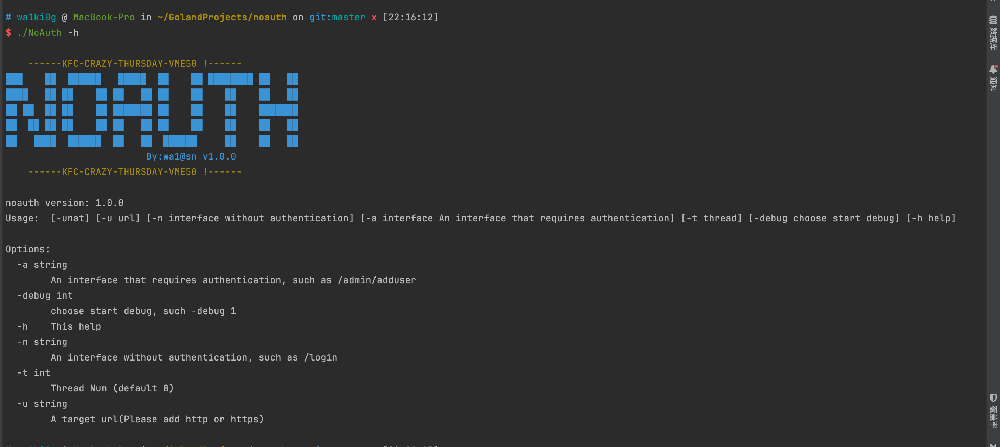
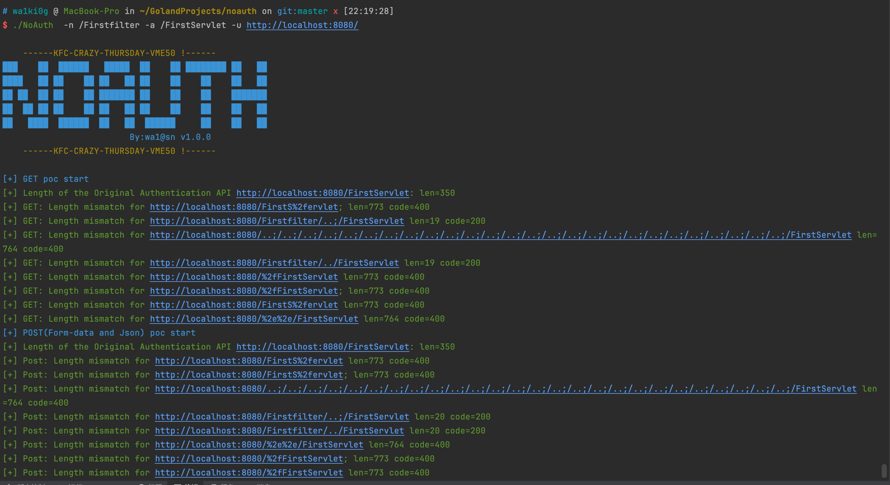
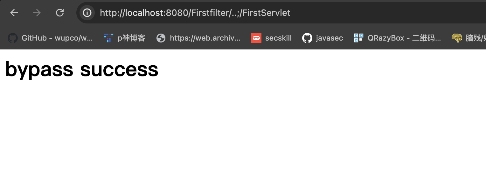
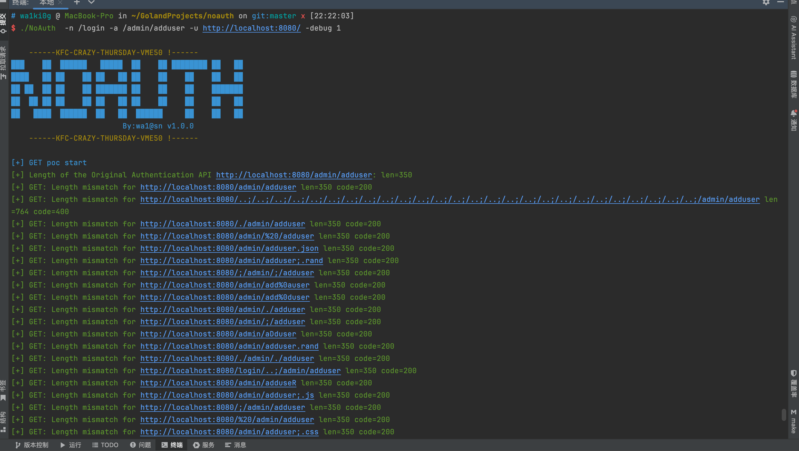

# NoAuth

## \[简介]

在Java代码审计中，经常会遇到接口因鉴权问题被组合拳getshell，例如泛微和海康安防这样的系统等。为了方便平时的代码审计，花了点时间分析了网上所有与Java鉴权问题相关的案例，写了这工具，主要用于动态生成可能用于绕过的payload进行fuzz测试。默认发送Get、Post-Form-datas、POST-json 数据包。

## \[功能]



```bash


Usage:  [-unat] [-u url] [-n interface without authentication] [-a interface An interface that requires authentication] [-t thread] [-debug choose start debug] [-h help]

Options:
  -a string
        An interface that requires authentication, such as /admin/adduser
  -debug int
        choose start debug, such -debug 1
  -h    This help
  -n string
        An interface without authentication, such as /login
  -t int
        Thread Num (default 8)
  -u string
        A target url(Please add http or https)


```

## \[使用方法]

NoAuth -n 不需要鉴权的接口地址(如/login、/register、/index.jsp、index.html等) -a 需要鉴权的接口地址 -u url地址

例：NoAuth -n /login -a /admin/adduser -u [http://localhost:8080/](http://localhost:8080/ "http://localhost:8080/")&#x20;

如图，成功利用[http://localhost:8080/Firstfilter/](http://localhost:8080/Firstfilter/ "http://localhost:8080/Firstfilter/")..;/FirstServlet  绕过鉴权





NoAuth  -n /login -a /admin/adduser -u [http://localhost:8080/](http://localhost:8080/ "http://localhost:8080/") -debug 1 ，添加 -debug 1 参数可查看所有请求 ：


